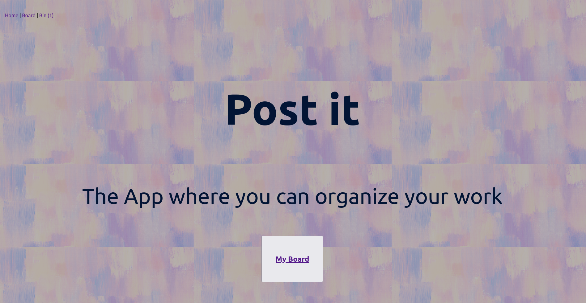
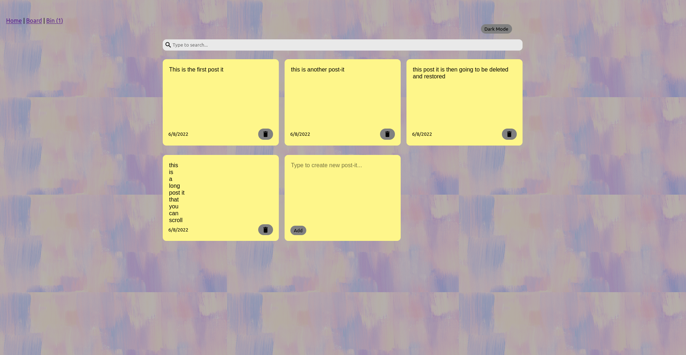
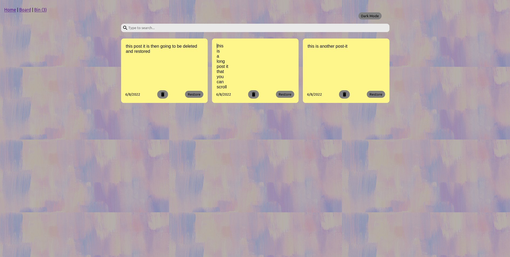
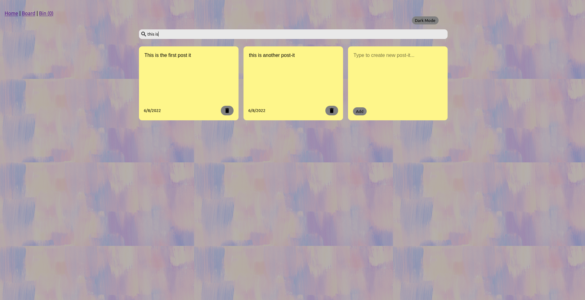
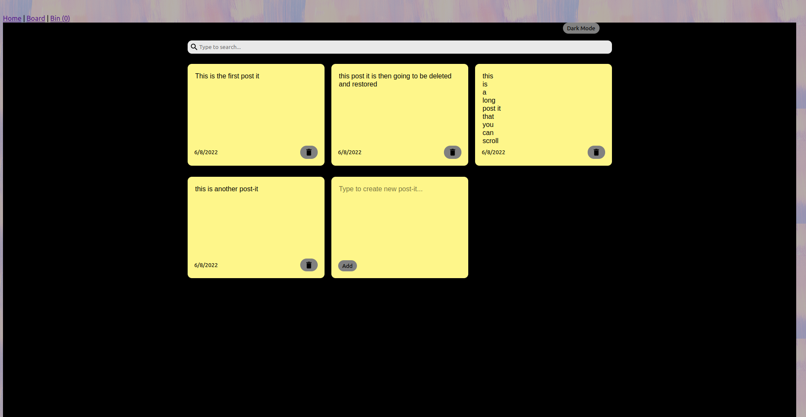

# Overview

Post-it is a app where you can organize your work by creating post-it notes.
You can also edit, delete and restore them from the bin.

# Features

    - Three-page React Application with CSS
    - Home features: go to Board
    - Board features: Create, Edit, Delete and Search
    - Bin features: Delete, Restore and Search

# To improve and add on the next update:

    - Use of Tailwind
    - Responsive Design
    - Improve Dark Mode
    - Unit Tests

# Demo

You can see a running version of the application at https://posti-it.herokuapp.com/

# Screenshots

 HOME:
 

 BOARD:
 

 BIN:
 

 Search mode:
 

 Dark mode:
 

# Installation

    This project was bootstrapped with Create React App and requires NPM to be installed.

    git clone git@github.com:LuciaOl/postit-challenge.git
    cd notes-react-app
    npm install 

# Usage

    npm start

